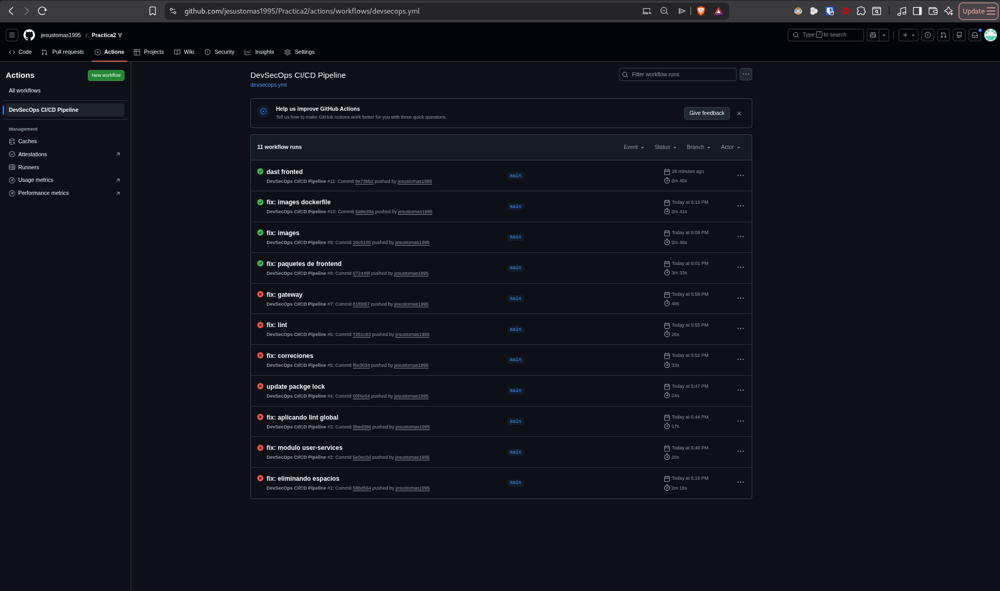
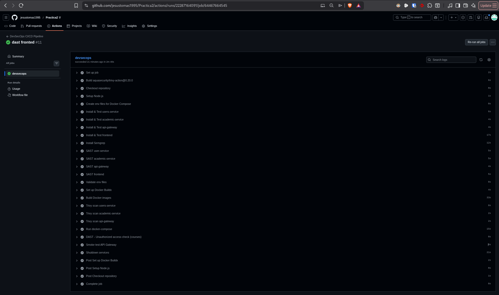
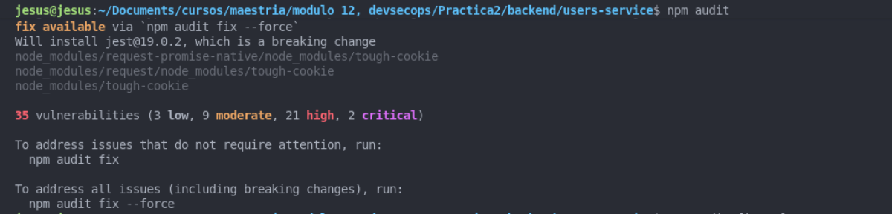
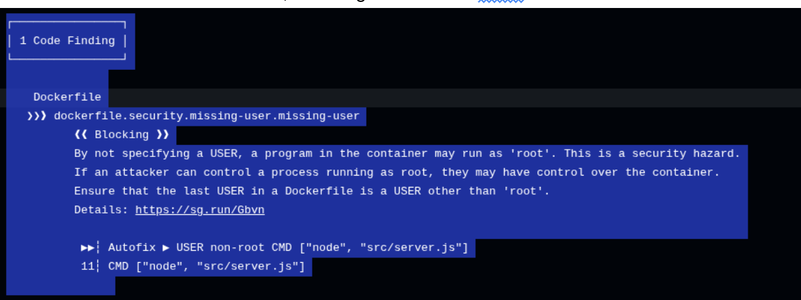

# Práctica 2 DevSecOps

## 0. Contexto académico de la práctica
Esta actividad corresponde a una tarea de maestría orientada a aplicar principios DevSecOps en un sistema realista de microservicios. El objetivo es demostrar dominio de automatización CI/CD, aseguramiento de la calidad y gestión de riesgos de seguridad a lo largo del ciclo de vida del software.

Alcance del proyecto
- Sistema con arquitectura de microservicios y frontend web.
- Construcción y escaneo de contenedores.
- Integración de SAST, SCA, pruebas y validaciones en CI/CD.

Entregables esperados
- Pipeline funcional en `.github/workflows/devsecops.yml`.
- Documento de justificación técnica (este archivo).
- Evidencias de ejecución (logs, capturas y enlaces a runs).

## 1. Análisis del repositorio base
Arquitectura general
- Frontend: React/Vite en `frontend/`.
- Backend: microservicios Node en `backend/users-service`, `backend/academic-service`, `backend/api-gateway`.
- Contenedores: Dockerfiles por servicio y `backend/docker-compose.yml`.

Flujo funcional
[ Frontend ] → [ users-service ] → [ api-gateway ] → [ academic-service ]

Verificación previa de funcionamiento
1. Crear `.env` desde `.env.example` en cada servicio.
2. Levantar todo con `docker compose -f backend/docker-compose.yml up -d --build`.
3. Verificar salud con `curl http://localhost:3000/health`.
4. Abrir el frontend en `http://localhost:5173`.

## 1.1 Corroboración de la extensión Front-end y login
Arquitectura y flujo con autenticación
[ Front-end ] → [ users-service ] → [ api-gateway ] → [ academic-service ]

Integración DevSecOps obligatoria para Front-end y login
- SAST: análisis del código de autenticación y manejo de inputs.
- SCA: análisis de dependencias relacionadas con seguridad.
- DAST: pruebas de acceso no autorizado a endpoints protegidos.
Nota: el login no se asume seguro, se valida automáticamente.

Propósito de la extensión
Consolidar una visión end-to-end DevSecOps donde diseño, seguridad, automatización y experiencia de usuario se integran desde etapas tempranas.

## 1.2 Flujo esperado del pipeline (visión general)
Commit / Pull Request → Tests automatizados → SAST (Semgrep) → Build (Docker) → SCA (dependencias) → Deploy automático → DAST (aplicación en ejecución)

## 1.3 Docker Compose (uso local)
1. `docker-compose down`
2. `docker-compose up --build`

## 1.4 Estructura del pipeline implementado
Push / Pull Request → Install dependencies → Tests (backend + frontend) → SAST (Semgrep) → Build Docker images → SCA (Trivy) → docker-compose up → Smoke tests

## 2. Pipeline CI/CD
Archivo: `.github/workflows/devsecops.yml`
Disparadores: `push` a `main` y `pull_request`

Etapas incluidas
1. Instalación reproducible: `npm ci` por servicio.
2. Calidad de código: `npm run lint` con ESLint.
3. Testing automático: `npm test` por servicio.
4. SAST: Semgrep con `--config=auto --severity=ERROR`.
5. SCA dependencias: `npm audit --omit=dev --audit-level=critical`.
6. Build contenedores: `docker compose build` con `IMAGE_TAG=${{ github.sha }}`.
7. Seguridad contenedores: Trivy sobre imágenes taggeadas por SHA.
8. Smoke test: `curl -fsS http://localhost:3000/health`.

## 3. Cumplimiento de requisitos
1. Instalación reproducible: Cumple. Evidencia en `.github/workflows/devsecops.yml` con `npm ci`.
2. Análisis de calidad: Cumple. ESLint integrado en backend y frontend.
3. Testing automático: Cumple. `npm test` falla el pipeline si hay errores.
4. SAST: Cumple. Semgrep en los tres servicios backend.
5. SCA: Cumple. `npm audit --omit=dev --audit-level=critical` bloquea riesgos críticos.
6. Build de contenedores: Cumple. `docker compose build` con versionado por SHA.
7. Seguridad de contenedores: Cumple. Trivy escanea imágenes y falla por CRITICAL.
8. Verificación de ejecución: Pendiente de evidencia. Ver sección 5.

## 4. Acciones de remediación de vulnerabilidades
Se tomaron acciones para subsanar vulnerabilidades reportadas por `npm audit` y escaneos de imágenes:
1. Actualización de dependencias directas en backend y frontend (`glob`, `cross-spawn`, `tar`, `jest`, `eslint`).
2. Reubicación de dependencias de testing a `devDependencies` para no afectar runtime.
3. Uso de `overrides` en `package.json` para forzar versiones seguras de dependencias transitivas (`minimatch`, `rimraf`, `node-notifier`, `qs`, `tough-cookie`, `tmp`).
4. Regeneración de `package-lock.json` con `npm install` para sincronizar con `package.json`.
5. Ajuste de Dockerfiles para ejecutar como usuario no-root.

## 5. Justificación técnica
Resumen de herramienta, fase y riesgo mitigado:
1. `npm ci`: garantiza instalaciones reproducibles y falla con lockfiles inconsistentes.
2. ESLint: detecta errores comunes y malas prácticas antes de pruebas/despliegue.
3. Jest: valida comportamiento; evita regresiones.
4. Semgrep: detecta vulnerabilidades en código fuente antes de build.
5. `npm audit`: detecta CVEs en dependencias; bloquea riesgos críticos.
6. Docker Buildx + Compose: construye artefactos versionados por SHA para trazabilidad.
7. Trivy: escanea imágenes por CVEs del SO base y librerías internas.
8. Smoke test: valida disponibilidad del API Gateway en ejecución.

## 6. Evidencia de ejecución
Para cumplir este punto, adjuntar:
1. Logs del workflow en GitHub Actions.

2. Capturas de pantalla de las etapas ejecutadas.

3. Enlace a la ejecución (exitosa o fallida con justificación).
4. Capturas de vulnerabilidad de las dependencias de node en los proyectos: backend y fronted

5. Captura de vulnerabilidades de dockerfile

URLs de evidencia (completar):
1. Repositorio:  `https://github.com/jesustomas1995/Practica2`
2. Ejecución en GitHub Actions: `https://github.com/jesustomas1995/Practica2/actions/runs/22287164091/job/64467664545`